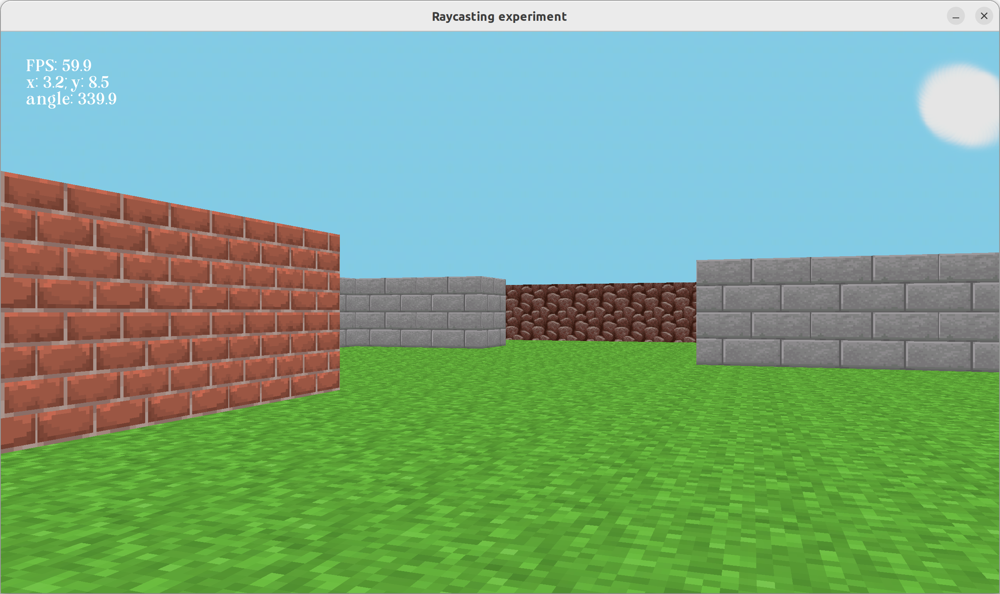

# 3D game tutorial (port to Rust)

## Update 2022-01-03

Changed the textures again to give a better look (I'm using some Minecraft textures for now, but since this is a tutorial, I'm sure it's fine). Also optimized the floor rendering a little bit, but it's still far from perfect.

## Update 2022-01-02

I changed the textures, and (more importantly) added ground rendering. The algorithm needs a lot of optimization, but it works correctly at least.

---

Porting to Rust a Python tutorial for creating a 3D game made by [StanislavPetrovV](https://github.com/StanislavPetrovV/DOOM-style-Game), here's the [Youtube link](https://www.youtube.com/watch?v=ECqUrT7IdqQ).

*Caution!* This is a work in progress, I have migrated it to Tetra (highly recommend this engine).

In any case, this project is only intented as a learning experience, for me and (I hope) for a few other people, if I manage to finish it.
